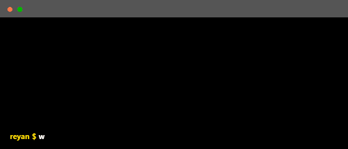

<!--
    Hey there, I'm Reyan Patel!
    Like my README? Take it, but drop a follow and connect below
    
    LinkedIn https://www.linkedin.com/in/reyanp/
-->

    

### Main skills  

### Studying / Exploring  

### Connect with me!

  
  &nbsp
    

